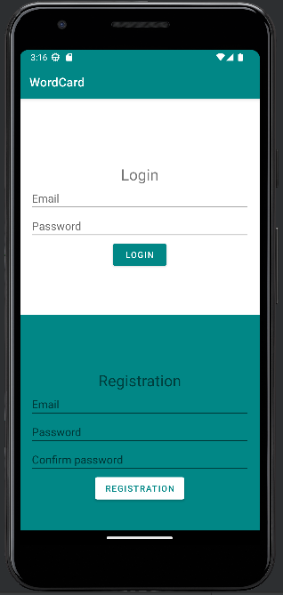
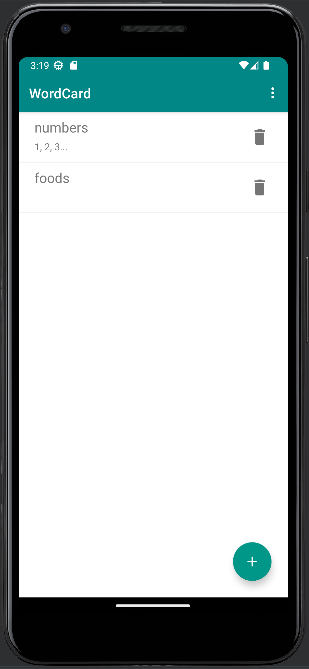
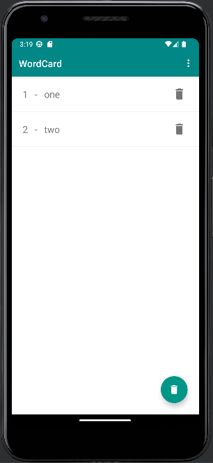
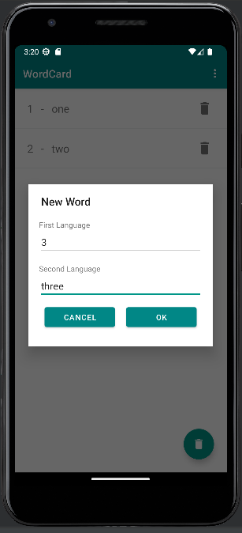
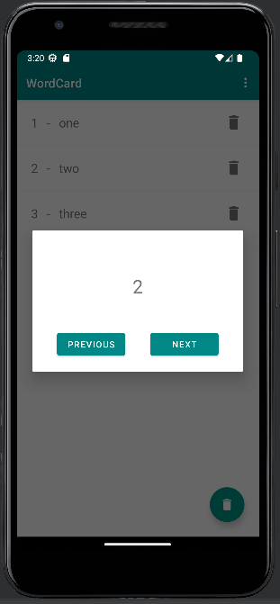

# Mobile- and Web-based Software (VIAUAC00) - Wordcard

## Introduction

When learning a language, it is helpful to test yourself with vocabulary cards to see how well you have mastered the word or phrase.
I used to use a lot of similar vocabulary to learn, which is where the idea for this app came from. 

## Main features

- The home screen of the app will be a login interface where new users will be able to register. It will also be possible to log out of the app.
- After that, a list of the already created solo lists will be displayed. It will also be possible to add new ones, which will be saved. 
- On the second screen, you can click on the wordlist of your choice to see the cards in the list, to which you can add new ones.
- If we click on Learn from the list we opened before, we can do this on another screen where we will see the list items in card form. Clicking on them
the card is turned over, you can also view the report associated with it.

## Images

